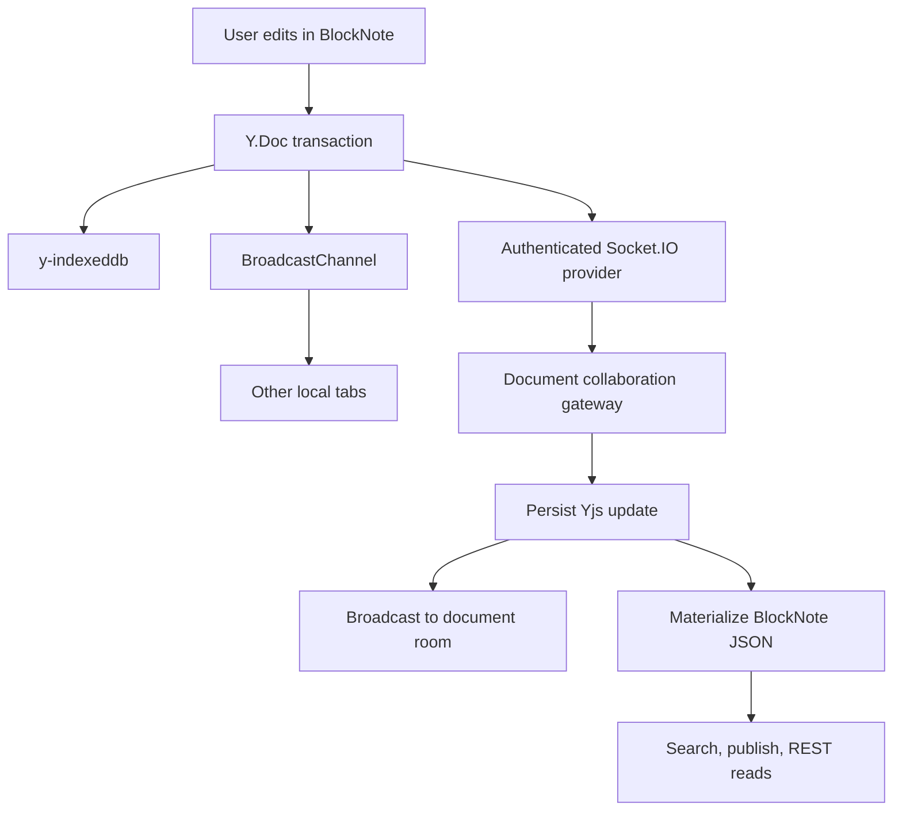

# Document Edit Flow

## Purpose

This document describes the collaborative editing path from the browser Y.Doc through local persistence, cross-tab synchronization, Socket.IO, and PostgreSQL for both BlockNote content and shared document metadata such as title.

## High-Level Flow

## Document Open

1. The browser creates one `Y.Doc` for the document route.
2. `y-indexeddb` applies locally persisted updates.
3. A document-scoped BroadcastChannel connects tabs in the same browser.
4. The Socket.IO provider connects to the `/collaboration` namespace using the HTTP-only access cookie.
5. The API verifies workspace membership and joins `document:{documentId}`.
6. The browser sends its Yjs state vector.
7. The API lazily creates the initial Y.Doc from existing `content_json`, or loads the latest snapshot and update log.
8. The API returns the server state vector and the update missing from the browser.
9. The browser calculates its update missing from the server, applies the server update, and sends any offline changes.
10. The document screen binds shared metadata such as `meta.title` from the synchronized `Y.Map`.
11. BlockNote mounts with its built-in `collaboration` option and the synchronized `Y.XmlFragment`.

BlockNote does not receive `initialContent` in collaboration mode. Existing JSON content is converted with `blocksToYDoc()` only when the server initializes collaboration state for the first time. The server also seeds `meta.title` from `documents.title` during that initialization.

## Local Edit

1. Title edits write to `meta.title`; body edits write to the collaborative `Y.XmlFragment`.
2. Yjs emits a binary update for either kind of change.
3. `y-indexeddb` persists the update for recovery and offline use.
4. BroadcastChannel sends the update to other local tabs.
5. The Socket.IO provider sends the update to the API when connected.
6. Updates received from BroadcastChannel or Socket.IO use transport-specific origins and are not echoed back.

Yjs updates are commutative and idempotent. Duplicate, delayed, and out-of-order delivery converges to the same document.

## Remote Update

1. The collaboration gateway confirms the socket joined the document room.
2. The application service rechecks edit permission.
3. The update is applied to the active server Y.Doc.
4. The binary update is appended to PostgreSQL with a document sequence and SHA-256 deduplication hash.
5. The merged Y.Doc is materialized into derived projections for both `meta.title` and BlockNote JSON content.
6. `documents.title`, `documents.content_json`, search text, and subdocument references are refreshed without replacing the canonical Y.Doc.
7. Only after persistence succeeds does the gateway broadcast the update to other sockets.
8. Every 100 updates, the API stores a compact Yjs snapshot and removes covered updates.

## Offline And Recovery

- IndexedDB stores Yjs updates instead of a replaceable JSON recovery draft.
- A cached document can open without the API and remains editable.
- Reconnection uses state vectors to transfer only missing updates in both directions.
- Recovery prompts and latest-wins content saves are disabled for collaborative documents.
- Awareness and cursor state are ephemeral and expire when clients stop sending updates.

## Canonical And Derived State

- Yjs snapshots plus updates are canonical document state.
- `meta.title` inside the Y.Doc is the canonical document title.
- `documents.title` and `documents.content_json` are derived projections used by existing REST reads, search, publishing, and navigation summaries.
- Normal REST document updates reject content replacement after collaborative state exists.
- Archive state, permissions, hierarchy, and other metadata continue to use REST optimistic locking.
- Subdocument commands remain REST workflows, but successful editor changes are committed into the Y.Doc so projection converges with command results.

## Current Operational Boundary

Active Y.Docs and Socket.IO rooms are process-local. A multi-instance API deployment requires a Socket.IO Redis adapter or equivalent pub/sub so updates broadcast across instances. PostgreSQL update sequencing remains the durable source for reconnect synchronization.
