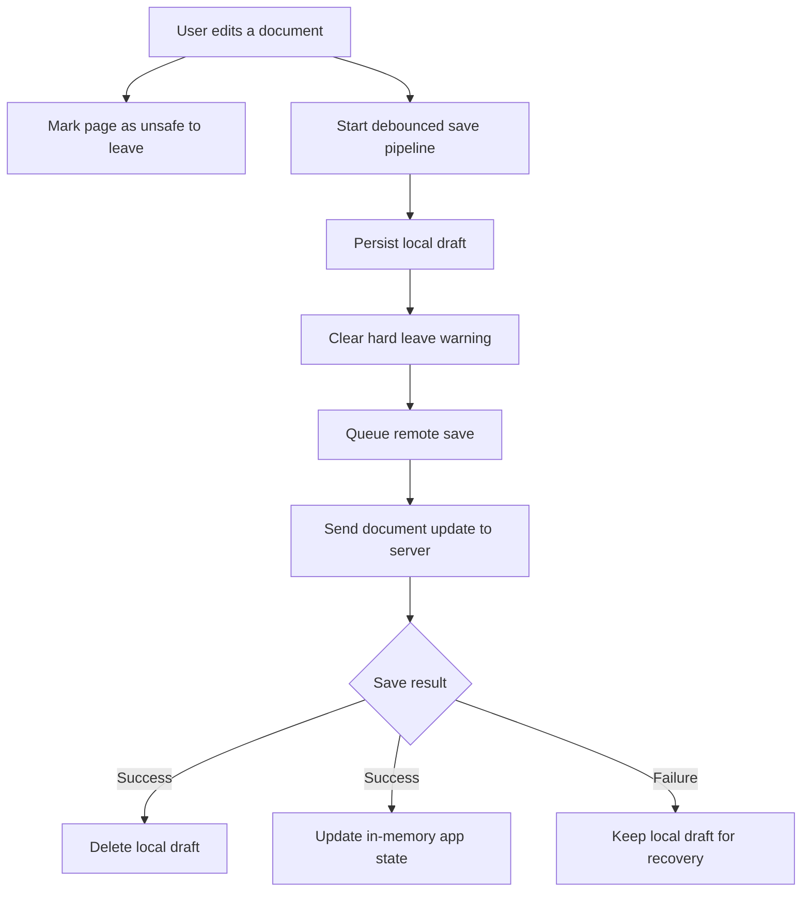
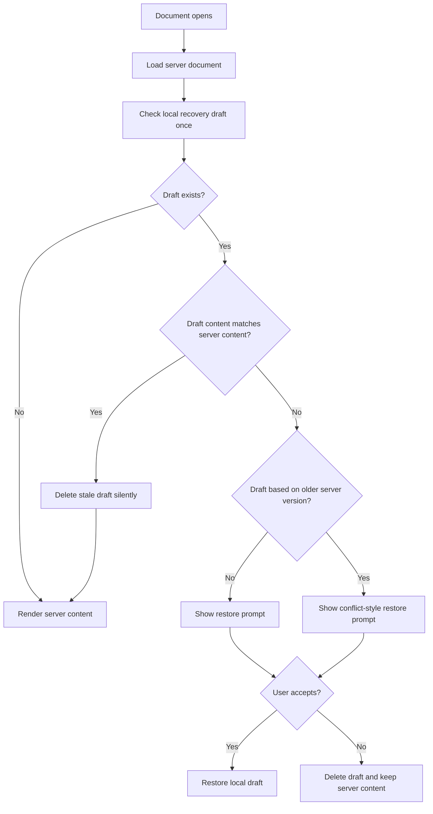

# Document Edit Flow

## Purpose

This document describes how a document edit moves from browser state to local recovery storage and then to the server.

It documents the current behavior in the web app, not a generic offline-first architecture.

## High-Level Flow

## Detailed Flows

### Normal edit and autosave

1. The user edits document content in the browser.
2. The app immediately treats the page as unsafe to leave.
3. The app debounces edits before starting the save pipeline.
4. The app writes the newest content to local durable storage as a recovery draft.
5. After local persistence succeeds, the hard leave warning is removed.
6. The app queues a remote save using the latest local content.
7. The app sends the document update to the server.
8. On success, the local draft is deleted and in-memory app state is refreshed.
9. On failure, the local draft remains available for recovery.

### Refresh or crash before remote save completes

1. The local draft has already been persisted.
2. The remote save has not completed, or the browser exits before completion.
3. When the document is opened again, the app loads the server version first.
4. The app then checks once for a recoverable local draft.
5. If the local draft differs from server content, the app offers to restore it.

### Refresh before local persistence completes

1. The user edits the document.
2. The app marks the page as unsafe to leave immediately.
3. If the user refreshes before local persistence completes, the browser should warn that leaving may lose data.
4. If the page still exits before local persistence finishes, the newest keystrokes can be lost because no durable local draft exists yet.

### Recovery on reopen

### Conflict and prompt behavior

- If local draft content matches server content, the draft is deleted silently.
- If local draft content differs and was created from the current known server version, the app shows a normal restore prompt.
- If local draft content differs and was created from an older server version, the app shows a conflict-style restore prompt.
- Recovery is checked once per document open so normal rerenders do not repeatedly prompt.

## Key Guarantees

- The server is the source of truth for canonical document state.
- Local browser storage is a recovery layer, not the primary document store.
- Content saves use a latest-wins approach rather than sending every intermediate edit.
- The browser warns if the user tries to leave before local persistence completes.
- A successfully saved document clears its local recovery draft.

## Known Limitations

- The last keystroke can still be lost if the browser exits before local persistence finishes.
- The current implementation supports draft recovery, not a full offline mutation outbox.
- There is no multi-device merge strategy yet.
- Conflict handling is prompt-based, not an automatic merge flow.

## Terms Used In This Doc

- **Local draft**: the most recent recoverable document content stored in the browser
- **Remote save**: the request that persists document content to the server
- **Unsafe to leave**: the window where exiting the page may still lose the newest local changes
- **Recovery**: restoring locally persisted content after refresh, crash, or restart

## Suggested Follow-up Docs

- Architecture Decision Record for why local browser persistence was added
- Offline and recovery edge cases
- Future outbox and conflict resolution design if offline editing grows
