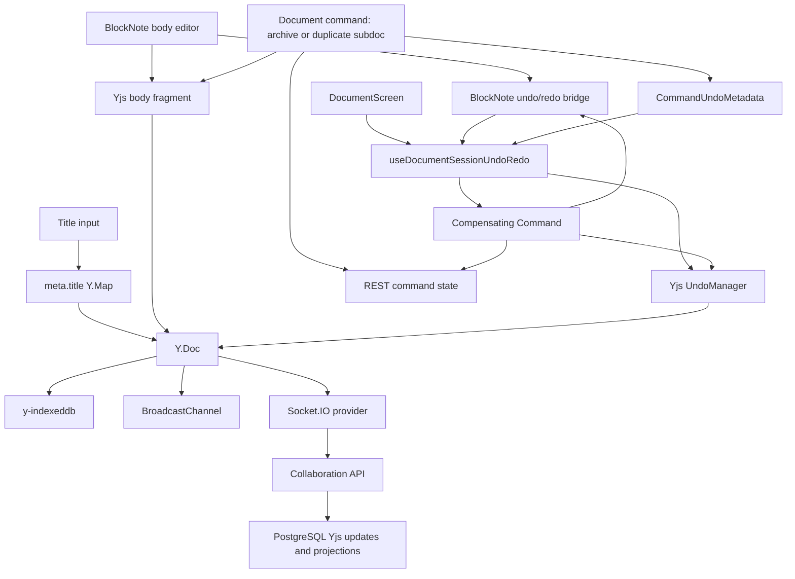
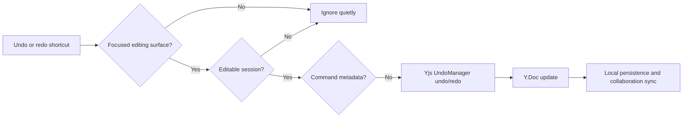
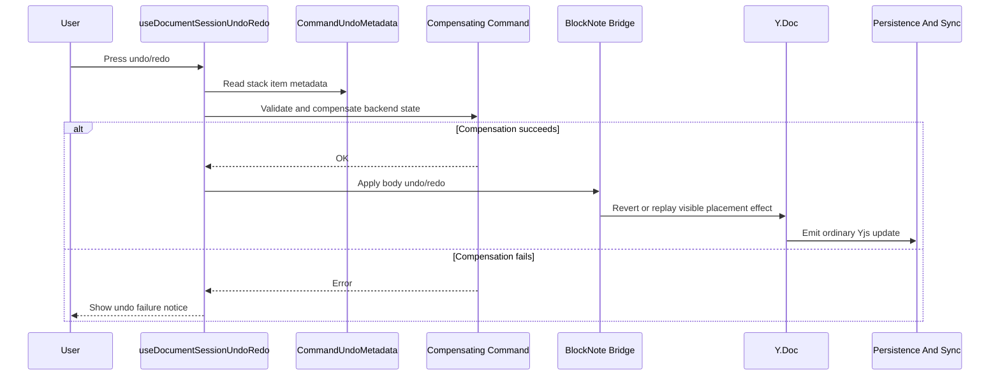
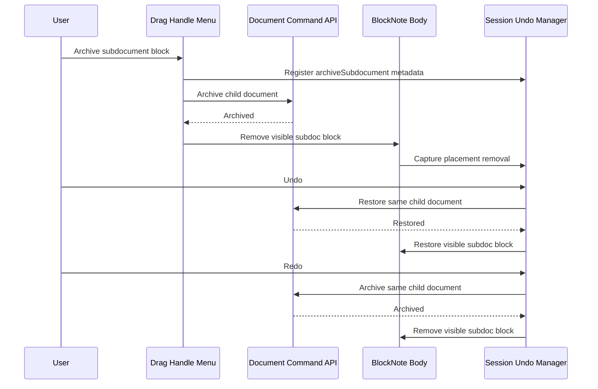
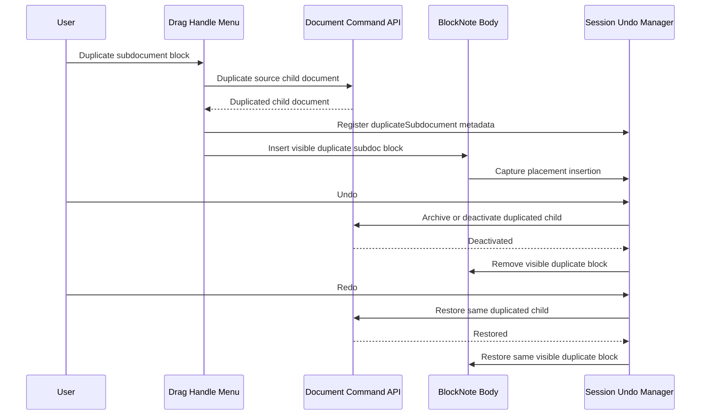

# Document Undo And Redo Design

## Purpose

This document describes the runtime wiring for browser-local document undo and redo. It complements the Yjs undo ADR by showing how the document screen, BlockNote editor, Yjs undo manager, command metadata, and collaboration sync fit together.

Undo and redo are editing-session behavior. They are not durable page history, audit-log rollback, or collaborator rollback.

## Components

- `DocumentScreen` owns the current editing session for one document route.
- `useDocumentSessionUndoRedo` owns shortcut handling and the session `Yjs.UndoManager`.
- `Yjs.UndoManager` tracks eligible local transactions against the collaborative `Y.Doc`.
- `meta.title` stores the document title inside the shared Yjs metadata map.
- BlockNote writes body edits into the collaborative Yjs body fragment.
- The BlockNote undo/redo bridge delegates compensated body undo/redo back to BlockNote when cursor and editor state matter.
- `CommandUndoMetadata` stores in-memory context for command-related undo entries.
- Compensating Commands restore or archive backend document state before replaying visible placement effects.
- `y-indexeddb`, BroadcastChannel, and Socket.IO persist and synchronize resulting Yjs updates.

## High-Level Flow



## Normal Local Edit

1. The user edits the title input or BlockNote body.
2. Title edits transact against `meta.title` with the local document edit origin.
3. Body edits transact through BlockNote and y-prosemirror into the collaborative body fragment.
4. `Yjs.UndoManager` captures the local transaction when the origin is eligible.
5. Remote, socket, broadcast, initialization, and system synchronization origins are excluded from the local undo stack.
6. The resulting Yjs update is persisted locally, broadcast to sibling tabs, and sent to the collaboration API when connected.
7. Server-side projections eventually refresh REST-readable title, content JSON, search, publish, and navigation state.

```mermaid
sequenceDiagram
  participant User
  participant Title as Title Input
  participant Body as BlockNote
  participant Undo as Yjs UndoManager
  participant Doc as Y.Doc
  participant Sync as Persistence And Sync

  User->>Title: Type title
  Title->>Doc: transact meta.title with local origin
  Doc->>Undo: capture eligible local title edit
  Doc->>Sync: emit ordinary Yjs update

  User->>Body: Type, format, insert, delete
  Body->>Doc: transact body fragment
  Doc->>Undo: capture eligible local body edit
  Doc->>Sync: emit ordinary Yjs update
```

## Shortcut Handling

1. `useDocumentSessionUndoRedo` listens for undo and redo shortcuts at the document level.
2. Cmd/Ctrl+Z runs undo.
3. Cmd/Ctrl+Shift+Z and Ctrl+Y run redo.
4. Shortcuts only run while the document is editable and focus is in an editing surface: title input or body editor.
5. Empty stacks, read-only sessions, archived documents, and unrelated focus targets are quiet.

## Undo Or Redo Without Command Metadata

1. The shortcut resolves the active undo or redo stack item.
2. If the entry has no command metadata, the session undo manager applies `undo()` or `redo()` directly.
3. The resulting Yjs update synchronizes like any other document edit.
4. Other collaborators see the result, but their local undo stacks do not record the original user's local history.



## Command Undo Or Redo

Document commands are undoable only for their visible placement effect in the current body. If a visible placement effect depends on backend state, the compensating command must succeed before applying the body undo or redo.

Current command metadata covers archive subdocument placement effects and duplicate subdocument placement effects.



## Archive Subdocument Placement

Undo after archiving a subdocument block:

1. Archive command metadata identifies the archived child document.
2. Undo runs a restore compensating command for that same child document.
3. Only after restore succeeds does BlockNote/Yjs restore the visible subdoc block placement.
4. If restore fails, the visible body remains unchanged and the user sees an undo failure notice.

Redo after undoing that archive:

1. Redo uses the same command metadata.
2. Redo runs an archive compensating command for the same restored child document.
3. Only after archive succeeds does BlockNote/Yjs remove the restored visible placement again.



## Duplicate Subdocument Placement

Duplicate currently creates a new backend document subtree and inserts a visible subdoc block in collaborative mode.

Compensated duplicate undo/redo uses session metadata to identify:

- the source subdocument,
- the duplicated subdocument,
- the anchor or placement identity,
- the parent/current document identity,
- validation context for permission and lifecycle checks.

Undo should remove the duplicate placement and deactivate or archive the duplicated subtree. Redo should restore the same duplicated subtree and placement when possible instead of creating a fresh duplicate identity.



## Session Boundaries

Undo and redo history is in memory only. It clears when:

- the document route changes,
- the page reloads or browser restarts,
- collaboration readiness is lost,
- edit permission is lost,
- the document becomes archived,
- a new document edit branches history after undo.

Persisted Yjs state can recover document content, but it must not recover the undo stack, redo stack, or command undo metadata.

## Related Documents

- [Document Edit Flow](./document-edit-flow.md)
- [Use Yjs-Level Session Undo For Document Editing](./adr/0001-use-yjs-level-session-undo-for-document-editing.md)
