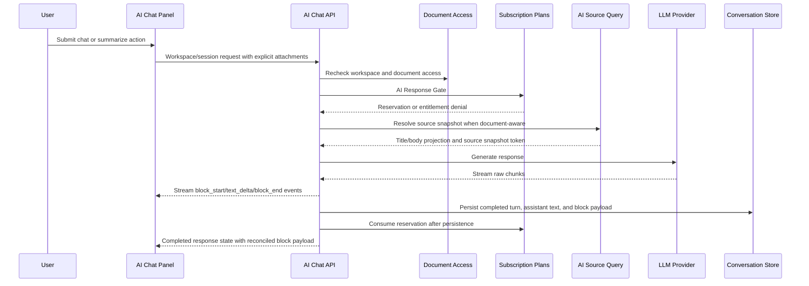

# AI Assistance Flow

This document is the top-level implementation map for Camille AI Assistance. Detailed subflows live under [`flows/`](./flows/).

## Entry Points

- Workspace-level AI shell opens the AI Chat Panel.
- Document route registers the active document as removable AI Document Context while mounted.
- AI Chat Panel Action starts an AI Chat Turn or AI Text Transform.
- Assistant message action labeled `Append to this document` appends a completed persisted assistant response block payload to the active editable document.
- Pending translate action is visible but disabled with coming-soon copy.

## Main Flow

1. User opens the AI Chat Panel.
2. If no session is selected, the panel shows a New AI Chat Draft.
3. If the user is on a readable document route, the route may register the current document as a removable AI Document Attachment.
4. User submits a chat message or summarize action.
5. Web client calls the backend-owned AI Chat API with workspace id, optional session id, user message or transform intent, and explicit AI Document Attachments.
6. API rechecks workspace membership.
7. API rechecks readable access for each AI Document Attachment.
8. API asks Subscription Plans for AI Response Gate access.
9. For Free Plan and Plus Plan trial access, Subscription Plans creates an AI Response Reservation before the provider call. Business Plan bypasses trial-pool consumption.
10. If the request needs document content, API resolves an AI Transform Source Snapshot through AI Source Query instead of trusting client-sent editor text or reusing document detail reads.
11. API enforces empty-content and direct-context size limits before calling the provider.
12. API calls the model provider and streams structured AI Response Block Stream events to the AI Chat Panel.
13. On valid completed response, API persists the AI Chat Turn, assistant response text, and reconciled AI Response Block Payload.
14. Subscription Plans converts the reservation into AI Response Consumption after the response reaches a completed persisted state.
15. If this is the first successful response in a session, the session receives an AI Conversation Title.
16. The panel keeps conversation sessions grouped by recent activity.

## UI States

### Default

- AI Chat Panel shows either a New AI Chat Draft or selected AI Conversation Session.
- Current document attachment appears as a removable badge when document context is registered.
- Session picker shows AI Conversation Groups such as recent and older sessions.
- AI Trial Counter appears for Free Plan and Plus Plan workspaces while trial access applies.

### Loading And Streaming

- Submitted turn shows generation progress.
- Structured Streaming AI Response blocks appear incrementally.
- Partial streaming block previews cannot be appended.
- Pending response should remain visually distinct from completed persisted assistant messages.

### Empty

- New AI Chat Draft has no persisted session until the first AI Chat Turn is submitted.
- Document-aware AI request with no meaningful Document Body text shows AI Empty Content Notice and does not call the provider.

### Success

- Completed valid response is persisted as an AI Chat Turn.
- First successful response can title the AI Conversation Session.
- Append success shows a toast and leaves the panel open.
- Append success does not force focus, navigation, scrolling, or panel close.

### Error

- Size-limit failure shows AI Size Limit Notice. The first release does not chunk, retrieve, or partially transform content.
- Entitlement denial shows an Upgrade Prompt when the Workspace AI Trial Pool is exhausted.
- Operational rate limits show AI Rate Limit Notice, separate from Subscription Plans entitlements.
- Provider failure or invalid generated draft shows a retryable AI Draft Failure Notice.
- Append failure shows a retryable toast and does not create a Document Edit.

### Permission Restricted

- Non-workspace users cannot use Workspace AI Chat.
- Document-specific collaborators and public viewers cannot use Workspace AI Chat.
- Attached-document requests fail if the user lacks readable access to any AI Document Attachment.
- Append action is hidden when no active document context exists and disabled or unavailable when the active document is not editable.
- Read-only document access can allow document-aware chat only for workspace members with readable access; it does not allow append.

## Responsive And Accessibility Notes

- The AI Chat Panel should keep primary actions keyboard reachable.
- Disabled Pending Translation Action must expose disabled state and coming-soon copy without triggering API calls.
- Streaming status, failures, trial counter changes, upgrade prompt, and append success/failure should be announced or surfaced without relying on color alone.
- Attachment badges need clear remove controls and accessible names that identify the attached document.
- Keyboard focus should remain predictable after append success; append does not force focus into the document body.

## Acceptance Criteria

- [ ] Workspace member can open AI Chat Panel and submit a chat turn from New AI Chat Draft.
- [ ] First successful assistant response creates or updates the AI Conversation Session and title state.
- [ ] Session picker groups AI Conversation Sessions by recent activity.
- [ ] Active readable document route can offer a removable AI Document Attachment.
- [ ] Removing an attachment affects future turns only.
- [ ] Attached-document summarize uses server-resolved source, not client-sent body text.
- [ ] Empty document-aware request shows AI Empty Content Notice and does not call the provider.
- [ ] Over-size document-aware request shows AI Size Limit Notice and does not chunk or retrieve.
- [ ] Free Plan and Plus Plan requests reserve trial-pool access before provider calls.
- [ ] Completed persisted valid response consumes one trial response.
- [ ] Failed, invalid, canceled, interrupted, size-limit, empty-content, rate-limit, and entitlement-denied outcomes do not consume a trial response.
- [ ] Exhausted trial pool shows Upgrade Prompt with owner/admin action and member ask-admin copy.
- [ ] Completed assistant response can be appended only from an active editable document route.
- [ ] Append uses the completed backend-normalized response block payload; unsupported provider syntax is normalized or degraded before persistence, and headings are downshifted for document body insertion.
- [ ] Append creates an AI-Assisted Document Edit with provenance metadata and no raw prompt/source retention.
- [ ] Append success keeps the panel open and shows success feedback.
- [ ] Append failure does not create a Document Edit and shows retryable feedback.
- [ ] Partial streaming block preview cannot be appended.
- [ ] External collaborators and public viewers cannot use Workspace AI Chat.

## Subflows

- [Session lifecycle](./flows/session-lifecycle.md)
- [Document context](./flows/document-context.md)
- [Streaming response](./flows/streaming-response.md)
- [Append to document](./flows/append-to-document.md)
- [Billing and retention](./flows/billing-and-retention.md)
