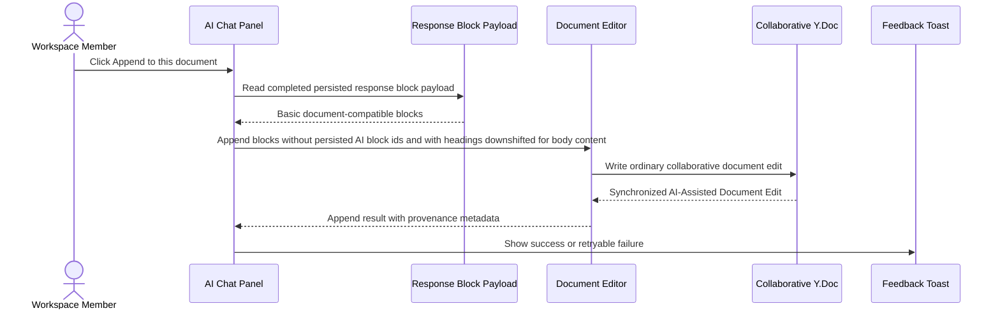

# Append To Document

This flow describes how a completed assistant response becomes an explicit AI-Assisted Document Edit in the current active document.

Summary:

- append requires an active editable document route
- append targets the current active document, not necessarily the original attachment
- append means end-of-document append, not cursor insertion or selected-range replacement
- only completed persisted assistant response block payloads can be appended
- backend normalization converts supported Markdown-lite into basic blocks and degrades unsupported syntax before persistence
- append downshifts heading levels for document body insertion, so AI level 1 headings become level 2 and deeper headings are capped at level 3
- repeated append creates another explicit Document Edit with fresh editor block ids
- append does not call the LLM provider or consume another AI response
- provenance stores session id, assistant message id, action type, actor, and timestamp
