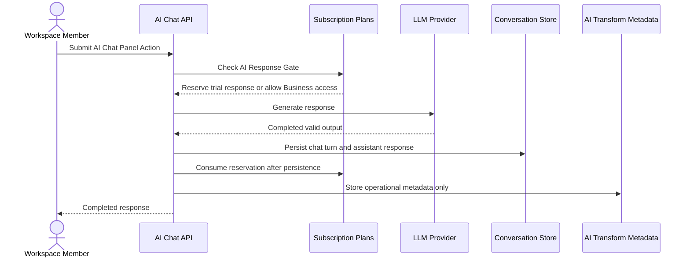

# Billing And Retention

This flow describes AI response gating, trial-pool consumption, and retained AI data.

Summary:

- Free Plan and Plus Plan use a workspace-owned shared trial pool
- initial trial allowance is 10 plus 5 per Billable Member
- AI Response Gate reserves before provider generation
- valid completed persisted responses consume one reservation
- empty, size-limit, entitlement-denied, rate-limited, failed, invalid, canceled, and interrupted outcomes do not consume trial access
- leaked reservations expire after 10 minutes
- Business Plan bypasses trial-pool consumption for ongoing AI access
- chat messages are product state; raw source snapshots and unapplied draft text are not retained as hidden history
