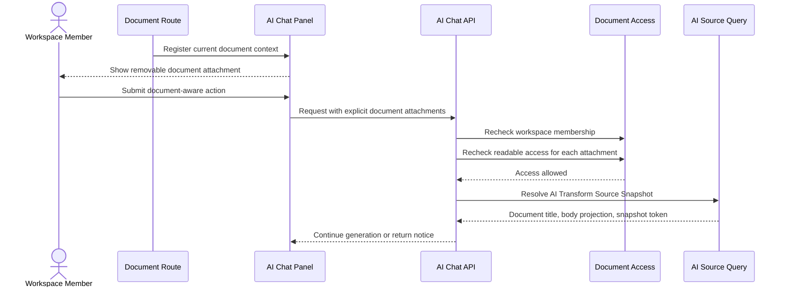

# Document Context

This flow describes how the active document becomes explicit AI context and how source text is resolved server-side.

Summary:

- document context is explicit attachment context, not workspace retrieval
- user can remove the active document attachment before future turns
- earlier turns keep their original attachment records
- server resolves title and body through AI Source Query
- client-sent editor text is not source of truth
- unsynced local edits are excluded until collaboration sync updates projection
- empty body and size-limit cases return notices before provider calls
