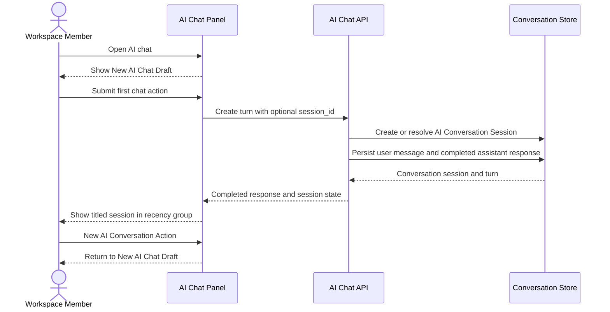

# Session Lifecycle

This flow describes how the AI Chat Panel moves from local draft state to a persisted user-private conversation session.

Summary:

- New AI Chat Draft is local, not a persisted empty session
- first submitted turn creates or resolves the AI Conversation Session
- AI Conversation Sessions are user-private inside a workspace
- successful first response titles the session
- session grouping follows last activity, not attached document
- New AI Conversation Action does not delete existing sessions
