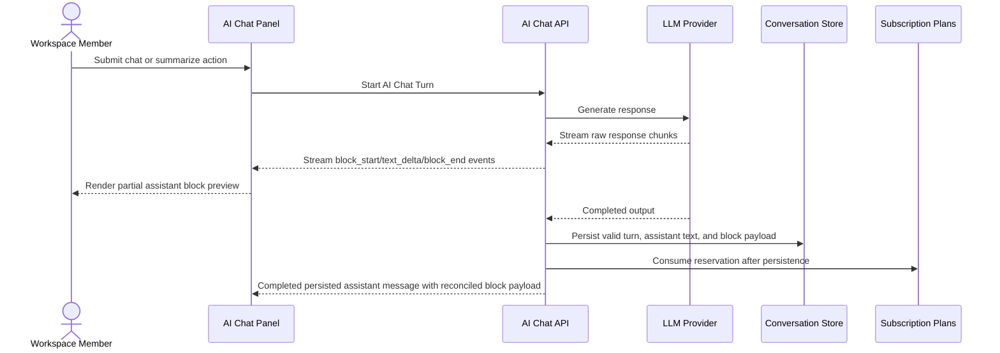

# Streaming Response

This flow describes how an AI Chat Turn streams to the panel and becomes persisted product state.

Summary:

- streaming is response delivery for an AI Chat Turn, not a background job
- partial streaming block previews are visible but cannot be appended
- append uses the completed persisted response block payload; copy uses completed assistant text
- invalid generated output shows a retryable failure notice
- failed, canceled, or interrupted streams do not consume trial access unless a valid response was persisted
